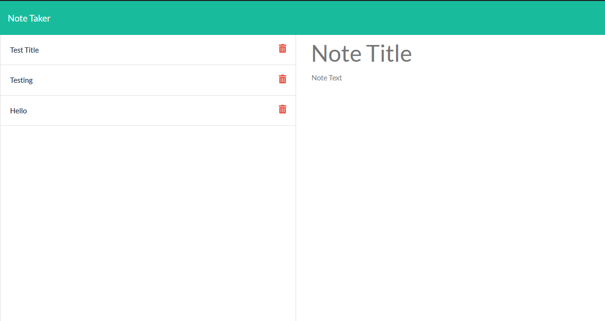

# Note Taker
URL to this repository https://github.com/LifeInvaderr/NoteKeeper

URL to the deployed site https://notekeeperandtaker.herokuapp.com/

## How I started this project
With this project, I started right after finishing the module, as I figured that I could compare both the last lesson, and my current challenge.
Also tasked with this project, I was looking for an alternative of node, to run the server and found Nodemon. This was great as I could see the progress I was making without having to manually start and stop the server. However this became a problem I will later discuss.

## What I had struggled with
With using Nodemon, this became a problem as to figuring out the bonus task. As with Nodemon, it will notice a change within the files and restart the server automatically. As with deleting an object within the array, Nodemon would automatically update the server.

After deploying to Heroku, that is when I had noticed the mistake.

## What I had learned
With this challenge, I learned not to trust the tools that I am using, and to see every possible outcome, ensuring that my program is working as intended.

Also, with this challenge, I have finally learned how to add images to the README, as with working on module 9 challenge, the README generator. I know understand the markdown function, as well as previewing on VS code. 

## What I will change
With this project, I still want to take a crack at the bonus challenge, as I believe I need to use fs.readFile, as to see the updated JSON file take effect on the /notes page.
